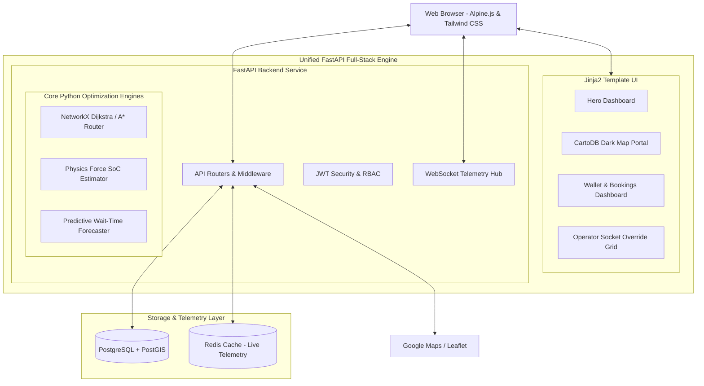

# AURA EV: AI-Powered Charging & Route Optimization Platform

AURA EV is a production-grade, full-stack Python SaaS platform designed to solve the critical inefficiencies in electric vehicle (EV) infrastructure. By merging fluid physics, graph theory algorithms, spatial GIS indexing, and high-fidelity cybernetic interfaces, AURA EV provides drivers with topography-aware route optimization, real-time charger queue estimations, Stripe wallet integrations, and clean solar-grid telemetry metrics.

---

## 🏗️ System Architecture



---

## ⚡ The EV Charging & Booking Process Flow

AURA EV models the complete lifecycle of electric vehicle transit, charging slot reservations, and session verification:

```
[Plan Route] ──► [Battery SoC Check] ──► [Low SoC warning? (SoC < 12%)]
                                                       │
         ┌─────────────────────────────────────────────┘
         ▼ (Yes)
[Locate Closest DC Fast Charger via PostGIS]
         │
         ▼
[Insert Charger as Optimal Stop on Graph] ──► [Lock Charger Slot] ──► [Deduct $2.00 Fee]
                                                                                │
                                                                                ▼
[Recharge vehicle to 85%] ◄── [Verify QR scanner at post] ◄── [Generate QR Verification Code]
```

1. **Topography-Aware Pathfinding:** The user plans a trip selecting coordinates. AURA EV solves the path using a **custom A* solver** that weighs edge distances alongside elevation slopes.
2. **State of Charge (SoC) Projection:** The physics engine calculates energy drain across each road segment. 
3. **Emergency DC Charger Insertion:** If the vehicle's projected SoC falls below 12% at any node, path calculation is intercepted at the last safe node. The system query filters the database using PostGIS to find the closest reachable fast-charger, inserts it as a waypoint, and plans a multi-stop path.
4. **Port Lockout & Booking:** Drivers select a port at the target station (e.g. 250kW CCS2) and reserve it. This locks the port state to `OCCUPIED` in the database, charges a $2.00 fee from their wallet, and compiles a secure cryptographic **QR Access Token**.
5. **Access Scan & OCPP Telemetry:** When arriving at the station, the driver scans the QR code. This triggers an OCPP WebSocket handshake simulation, releasing the socket and initiating charging.

---

## 🧮 Physics & Optimization Mathematics

### 1. Physics-Based Battery State-of-Charge (SoC) Estimator
To accurately predict remaining energy at destination, we evaluate the absolute mechanical forces acting on the vehicle:

$$P_{total} = P_{aerodynamic} + P_{rolling} + P_{gravity} + P_{auxiliary}$$

* **Aerodynamic Drag ($P_{aerodynamic}$):** Evaluates fluid wind resistance:
  $$P_{aerodynamic} = \frac{1}{2} \rho C_d A v^3$$
  * $\rho$ = Sea-level air density ($1.225 \text{ kg/m}^3$)
  * $C_d$ = Drag coefficient ($0.23$ for typical Tesla Model 3)
  * $A$ = Frontal area ($2.22 \text{ m}^2$)
  * $v$ = Vehicle velocity ($\text{m/s}$)
* **Rolling Resistance ($P_{rolling}$):** Evaluates tire friction:
  $$P_{rolling} = C_r m g \cos(\theta) v$$
  * $C_r$ = Rolling resistance coefficient ($0.01$)
  * $m$ = Vehicle mass + payload ($2000 \text{ kg}$)
  * $g$ = Gravitational acceleration ($9.81 \text{ m/s}^2$)
  * $\theta$ = Slope gradient angle ($\text{radians}$)
* **Gravitational Potential ($P_{gravity}$):**
  $$P_{gravity} = m g \sin(\theta) v$$
  * $\theta > 0$ (Climbing): Increases power drain.
  * $\theta < 0$ (Descending): Triggers **regenerative braking** energy capture:
    $$\text{Captured Energy} = \text{Mechanical Force} \times \eta_{regen}$$
    *(recovering up to 70% of potential energy back into the battery capacity)*
* **Auxiliary cabin loads ($P_{auxiliary}$):** Constant $1.5\text{ kW}$ draw modeling HVAC climate controls and onboard dashboard screen displays.

### 2. Topography Graph Routing
Traditional routing searches for the shortest path. AURA EV weighs each path edge dynamically inside NetworkX using:

$$\text{Weight} = \alpha \cdot \text{Time} + \beta \cdot \text{Energy\_Consumed} + \gamma \cdot \text{Queue\_Delay}$$

---

## 🛠️ Technology Stack

* **Full-Stack Framework:** FastAPI (Asynchronous ASGI server serving APIs, WebSockets, and HTML views).
* **Frontend HUD Canvas:** Jinja2 templates, Tailwind CSS, DaisyUI (cybernetic premium dark-mode panels), and Alpine.js (dynamic reactive client-side bindings).
* **Map Engine:** Leaflet.js styled with the pitch-black **CartoDB Dark Matter** skin.
* **Database & ORM:** SQLModel (SQLAlchemy + Pydantic) connecting to PostgreSQL + PostGIS (spatial index query calculations).
* **Optimization Systems:** NetworkX (Directed spatial road graphs) & NumPy (mechanical physics matrices).

---

## 📂 Project Layout

```
d:\EV CHARGING\
├── app/
│   ├── main.py                  # App Entrypoint, Static mounts & WebSockets
│   ├── core/                    # System setup, Security & Seeding
│   │   ├── config.py            # Environment configurations
│   │   ├── database.py          # SQLModel Engine and session factories
│   │   └── seed.py              # Seeds 6 high-fidelity SF stations & accounts
│   │
│   ├── models/                  # SQLModel schemas
│   │   ├── user.py              # Accounts, roles, wallet balance
│   │   ├── station.py           # Chargers, Ports & Solar Insights
│   │   ├── booking.py           # Reservations & Wallet Transaction ledgers
│   │   └── routing.py           # Historical Trip logs
│   │
│   ├── routers/                 # API controllers & HTML View routes
│   │   ├── auth.py              # JWT authentication endpoints
│   │   ├── stations.py          # PostGIS ST_DistanceSphere radius lookups
│   │   ├── routing.py           # Topography-aware path routing
│   │   ├── bookings.py          # Port lockout reservations
│   │   ├── wallet.py            # Stripe deposits & transactions ledger
│   │   └── chatbot.py           # Natural Language Assistant APIs
│   │
│   ├── engines/                 # Pure-Python Optimization & AI Core
│   │   ├── router.py            # Topography A* & Emergency reroute solver
│   │   ├── battery.py           # Fluid mechanics EV dissipation formula
│   │   └── queue_predictor.py   # Charger wait time forecaster
│   │
│   ├── templates/               # Visual Glassmorphic Jinja2 HTML Views
│   │   ├── base.html            # Core layout & AI Floating Assistant
│   │   ├── landing.html         # Premium Animated Hero spec grid
│   │   ├── portal.html          # Interactive CartoDB Dark Matter map canvas
│   │   ├── dashboard.html       # Wallet deposits & QR Code access
│   │   └── admin.html           # Fleet operator override chips
│   │
│   └── ws/                      # WebSocket broadcasts
│       └── connection_manager.py
│
├── tests/                       # Pytest test suite
├── docker-compose.yml           # Postgres, PostGIS & Redis container
├── requirements.txt             # Python packages
└── README.md                    # Platform documentation
```

---

## 🚀 How to Run the Platform Locally

Follow these 4 simple steps to boot the entire ecosystem on your local machine:

### Step 1: Boot Spatial Databases (Docker)
Ensure your Docker engine is running. Execute the compose command to spin up PostgreSQL + PostGIS and Redis in the background:
```bash
docker-compose up -d
```

### Step 2: Install Python Dependencies
Create a virtual environment (recommended) and install our high-performance mathematical and web packages:
```bash
pip install -r requirements.txt
```

### Step 3: Run the FastAPI Server
Boot our asynchronous full-stack server using Uvicorn. On startup, it will automatically register the PostGIS extension, migrate all SQLModel database tables, and seed the spatial grid with 6 realistic SF charging stations!
```bash
uvicorn app.main:app --reload --port 8000
```

### Step 4: Explore the Platform
Open your browser and navigate to:
* **Landing Portal:** `http://127.0.0.1:8000/`
* **Interactive Map:** `http://127.0.0.1:8000/portal`
* **Driver Dashboard:** `http://127.0.0.1:8000/dashboard`
* **Admin Health Grid:** `http://127.0.0.1:8000/admin`
* **Auto API Documentation:** `http://127.0.0.1:8000/docs` (Interactive Swagger APIs)

---

## 🛠️ Verification & Automated Test Suite

We have written a comprehensive verification test suite validating our physics calculations, NetworkX route optimizations, and wait forecasting.

### Running Automated Tests
Run `pytest` to execute all verification assertions:
```bash
pytest -v tests/test_main.py
```

### Test Case Verification Summary
1. **`test_battery_physics_climb`:** Asserts that driving up steep SF hills (e.g. Nob Hill) drains more energy than standard flat roads.
2. **`test_battery_physics_regen`:** Asserts that descending steep hills (e.g. Twin Peaks decline) correctly recovers kinetic and potential energy via regenerative braking, generating negative energy delta gains back to the battery.
3. **`test_router_solver_direct`:** Verifies that the NetworkX A* solver successfully routes the car through SF intersections, returning coordinates and step-by-step state-of-charge decay.
4. **`test_router_low_battery_reroute`:** Validates our **Emergency Low-Battery Fallback System**! If starting SoC is critically low (e.g. 15%), it intercepts A* execution, calculates reachable stations, inserts an ultra-fast CCS2 stop, charges the car to 85%, and routes the remaining path to destination.
5. **`test_queue_forecaster_rush_hour`:** Asserts that wait-times correctly elevate during peak morning commute times based on commute traffic multipliers.
