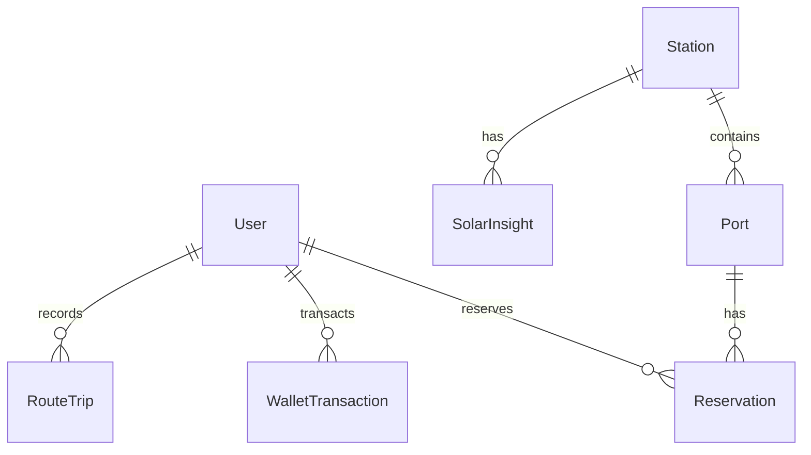

# Backend Schema & Database Architecture - GoBharat EV

This document outlines the SQLite/SQLModel entity schemas, table columns, relationships, and authentication token models managing GoBharat EV’s core platform data.

---

## 🏗️ 1. SQLite Entity Relationships

---

## 🗄️ 2. Database Model Schema Tables

### A. Users Table (`users`)
*   **Purpose**: Manages driver registration and wallet balances.
*   **Columns**:

| Column Name | Type | Key | Default | Constraints |
| :--- | :--- | :--- | :--- | :--- |
| `id` | UUID | PK | `uuid4()` | Indexed |
| `email` | String | | | Unique, Non-Nullable |
| `hashed_password` | String | | | Non-Nullable |
| `full_name` | String | | | Non-Nullable |
| `phone` | String | | | Nullable |
| `role` | String | | `"user"` | `"user"` or `"admin"` |
| `wallet_balance` | Float | | `100.0` | Default Starting Credits |

### B. Stations Table (`stations`)
*   **Purpose**: Stores physical coordinates and names of seeded charging terminals.
*   **Columns**:

| Column Name | Type | Key | Default | Constraints |
| :--- | :--- | :--- | :--- | :--- |
| `id` | UUID | PK | `uuid4()` | Indexed |
| `name` | String | | | Non-Nullable |
| `address` | String | | | Full address holding State & City |
| `latitude` | Float | | | Non-Nullable Coordinate |
| `longitude` | Float | | | Non-Nullable Coordinate |
| `rating` | Float | | `4.5` | Range `1.0` to `5.0` |
| `created_at` | DateTime | | `utcnow()` | |

### C. Sockets Table (`ports`)
*   **Purpose**: Stores individual charging sockets per station.
*   **Columns**:

| Column Name | Type | Key | Default | Constraints |
| :--- | :--- | :--- | :--- | :--- |
| `id` | UUID | PK | `uuid4()` | Indexed |
| `station_id` | UUID | FK | | References `stations.id` |
| `connector_type` | String | | | `"CCS2"`, `"CHAdeMO"`, `"Type 2 AC"` |
| `power_kw` | Float | | | e.g. `22.0`, `150.0`, `350.0` |
| `price_per_kwh` | Float | | `0.35` | In-currency electricity fee |
| `status` | String | | `"AVAILABLE"`| `"AVAILABLE"`, `"OCCUPIED"`, `"MAINTENANCE"` |

### D. Solar Insight Table (`solar_insights`)
*   **Purpose**: Telemetry logging tracking current solar generation and renewability score.
*   **Columns**:

| Column Name | Type | Key | Default | Constraints |
| :--- | :--- | :--- | :--- | :--- |
| `id` | UUID | PK | `uuid4()` | |
| `station_id` | UUID | FK | | References `stations.id` |
| `solar_output_kw` | Float | | `0.0` | Current solar array yield |
| `battery_storage_kwh`| Float | | `0.0` | Active stationary storage reserves |
| `renewable_percentage`| Integer | | `100` | Score percentage (0 to 100) |

### E. Driver Support Tickets Table (`support_tickets`)
*   **Purpose**: Saves driver inquiries and SLA resolutions.
*   **Columns**:

| Column Name | Type | Key | Default | Constraints |
| :--- | :--- | :--- | :--- | :--- |
| `id` | UUID | PK | `uuid4()` | Indexed |
| `name` | String | | | Non-Nullable |
| `email` | String | | | Non-Nullable |
| `subject` | String | | | Non-Nullable |
| `message` | String | | | Non-Nullable description |
| `status` | String | | `"OPEN"` | `"OPEN"` or `"RESOLVED"` |
| `created_at` | DateTime | | `utcnow()` | |

---

## 🔑 3. Authentication & Session Flow

GoBharat EV uses standard **JWT (JSON Web Token) Bearer** flows to secure active driver sessions:

1.  **Driver Registration**: Driver registers -> database persists hash password.
2.  **Authentication Handshake**: Driver posts form credentials -> server verifies, signs, and yields access token.
3.  **Local Memory Storage**: Client browser intercepts the response, storing the JWT bearer token in local storage:
    *   `localStorage.setItem('access_token', token)`
4.  **Authorized HTTP Header**: Client routes subsequent bookings or fault overrides passing bearer authorizations:
    *   `Authorization: Bearer <access_token>`
