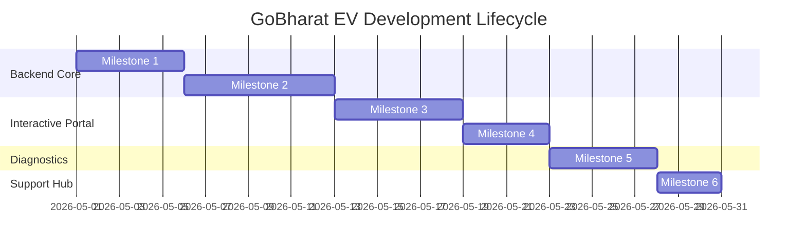

# Step-by-Step Implementation Plan - GoBharat EV

This document outlines the step-by-step development sequence, milestone objectives, and testing checkpoints used to build the **GoBharat EV** platform.

---

## 📅 Development Milestones Sequence



---

## 🏗️ Step-by-Step Build Milestones

### 🗄️ Milestone 1: Database Setup & Seed Engine
*   **Objectives**: Setup standard database schemas (Users, Stations, Sockets, Solar Insights).
*   **Development Steps**:
    1.  Design database mock engine in `sqlmodel.py` and `database.py`.
    2.  Write seed data in `seed.py` for users and the **25 Pan-India stations** (including the Kalmeshwar, Nagpur flagship hub).
    3.  Create startup initialization hooks (`on_startup`) in `main.py` to auto-detect old schemas and trigger re-seeding when the server boots.
*   **Testing Checkpoint**: Validate seeding length:
    ```python
    assert len(session.exec(select(Station)).all()) == 25
    ```

### ⛰️ Milestone 2: Physics Consumption Engine & A* Solver
*   **Objectives**: Solve directed graph elevations and kinetic depletion vectors.
*   **Development Steps**:
    1.  Program topographic junctions (Gateway of India, Lower Parel, Lonavala climbs) in `engines/router.py`.
    2.  Implement vector decay calculations (aerodynamic wind drag, precipitation wet drag coefficients, cabin PTC aux draw) in `engines/battery.py`.
    3.  Code topographic A* route planning APIs.
*   **Testing Checkpoint**: Verify climbs drain more absolute battery than flat segments, and steep descents correctly trigger regenerative braking recapture.

### 🗺️ Milestone 3: Interactive Map Portal & HUD Drawer
*   **Objectives**: Mount the full-width vector map portal and slide-up telemetry drawers.
*   **Development Steps**:
    1.  Initialize CartoDB dark matter maps inside `portal.html`.
    2.  Plot seeded terminals using divIcons (Green: Available, Orange: Occupied, Pink: Maintenance).
    3.  Build responsive SVG bottom charts charting mountain elevation profiles next to battery SoC curves.
*   **Testing Checkpoint**: Solve route to Lonavala and confirm SVG drawer slides up displaying interactive tracking tooltip values correctly.

### 📡 Milestone 4: Nationwide State & City Map Filters
*   **Objectives**: Program cascading state/city navigation dropdown filters on the map.
*   **Development Steps**:
    1.  Embed glassmorphic dropdown cards in the `portal.html` sidebar.
    2.  Develop JS regex address parser `parseStationAddress()` in Alpine.js component.
    3.  Implement map pin filter algorithms `filterMarkers()`.
    4.  Connect camera fitting coordinates using Leaflet transitions.
*   **Testing Checkpoint**: Choose "Maharashtra". Verify map bounds fit the coordinates. Choose "Nagpur". Confirm the map zooms in at level 12 to the Kalmeshwar hub.

### 🔋 Milestone 5: OCPP Charging Sandbox & WebSockets
*   **Objectives**: Stream diagnostics updates and render charging curves.
*   **Development Steps**:
    1.  Program charging curves tapering off at 80% SoC inside `dashboard.html`.
    2.  Implement WebSocket connection managers in `ws/connection_manager.py`.
    3.  Add diagnostic fault injection override buttons.
*   **Testing Checkpoint**: Inject over-voltage fault. Verify canvas line turns red, timer freezes, and the status changes to `MAINTENANCE` in the SQLite database, broadcasting updates.

### 🏢 Milestone 6: Operations Ticketing System
*   **Objectives**: Build persistent ticketing databases and operations dashboards.
*   **Development Steps**:
    1.  Create `SupportTicket` model in `ticket.py`.
    2.  Update `/api/contact/submit` API to write persistently to the database Session.
    3.  Add REST endpoints (`GET`, `PATCH status`, `DELETE`) in `main.py`.
    4.  Build operations dashboard panel inside `/admin`.
*   **Testing Checkpoint**: Submit ticket in `/support`. Confirm its UUID successfully prints, opens in `/admin`, is resolved, and is deleted cleanly.
